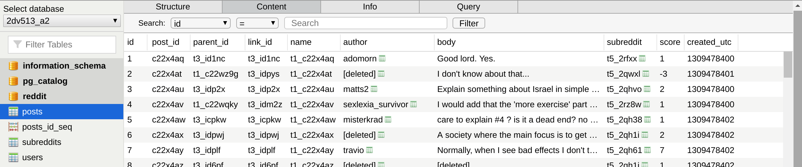
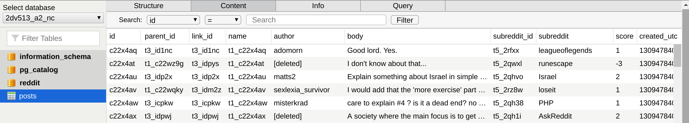

# Reddit Database

## About
PostgreSQL database to host Reddit data.

## E/R Diagram

## Database Schema

## Importing

When doing the importing I used the following:

- **Computer:** Lenovo X1 Carbon, RAM: 15,4 GiB, CPU: Intel® Core™ i7-8550U CPU @ 1.80GHz × 8, Graphics: Intel® UHD Graphics 620 (Kabylake GT2), OS-type: 64-bitars, SSD: 256,1 GB, OS: Ubuntu 19.10 
- **Programming Language:** Python 3.7 (psycopg2 connector module used)
- **Database Client:** Postbird
- **Dataset**: JSON file “RC_2011-07”

## Results

### Import with constraints

 

**Total amount of time for import:** 6:42:35.211313

### Import without constraints

 

**Total amount of time for import:** 5:35:23.910182

## License

The license is MIT. You are free to do whatever you want with it.
